<h1>Average Age at death in Germany </h1>

<h1>Average Age at death in Germany (Plotly Graph)</h1>
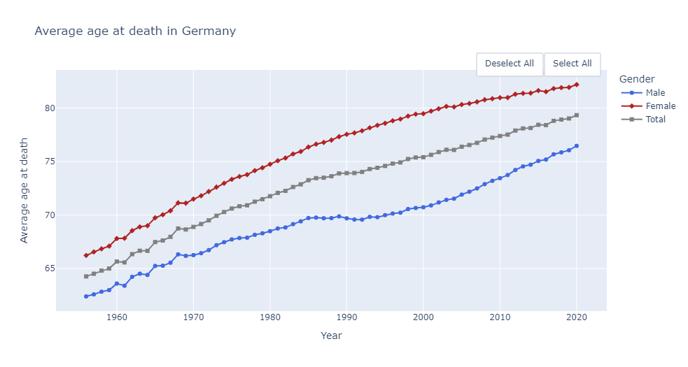

<h1>Bar graph on Average age at death </h1>
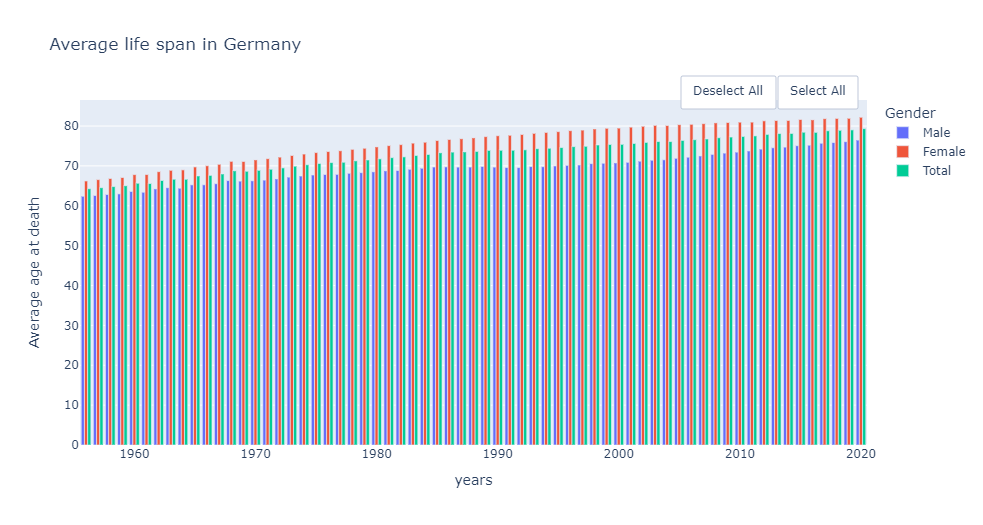

<h1>Avoidable mortality graph Germany </h1>
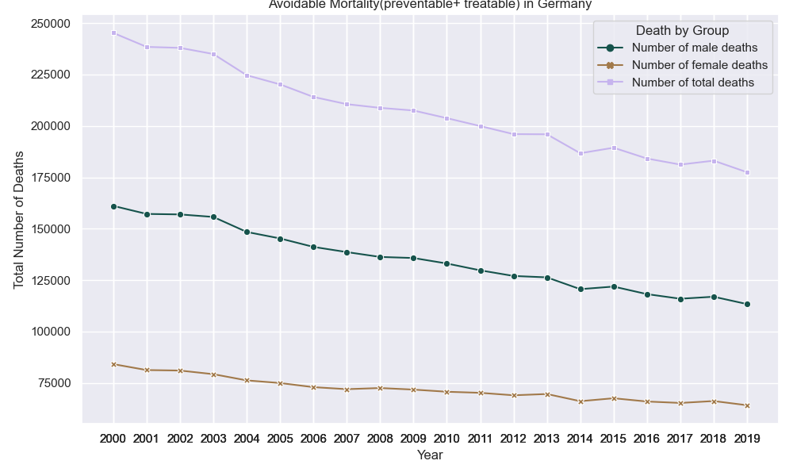
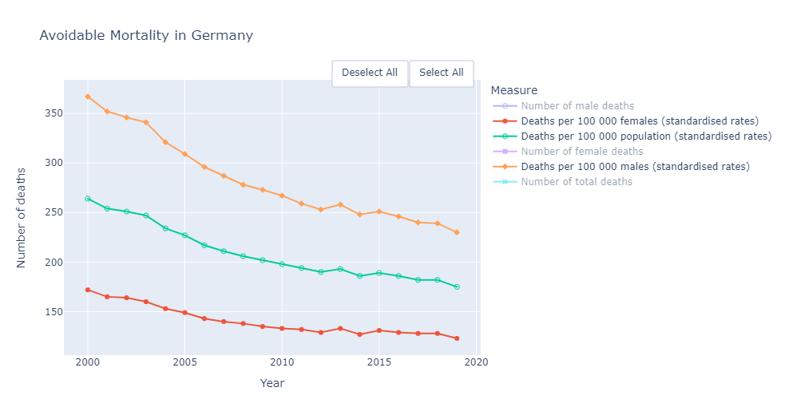

<h1>Preventable vs Treatable Mortality graph </h1>
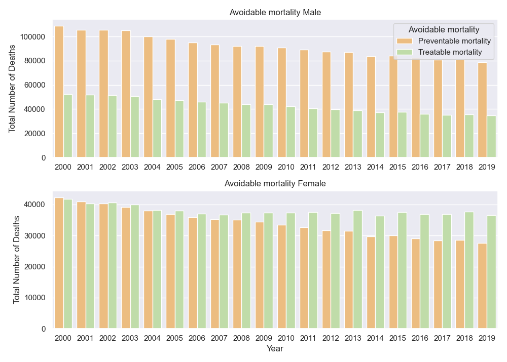

<h1>Avoidable mortality graph by country </h1>
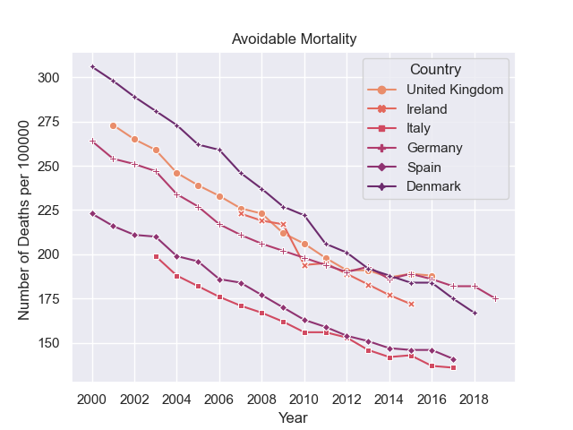
Plotly animated bar graph 
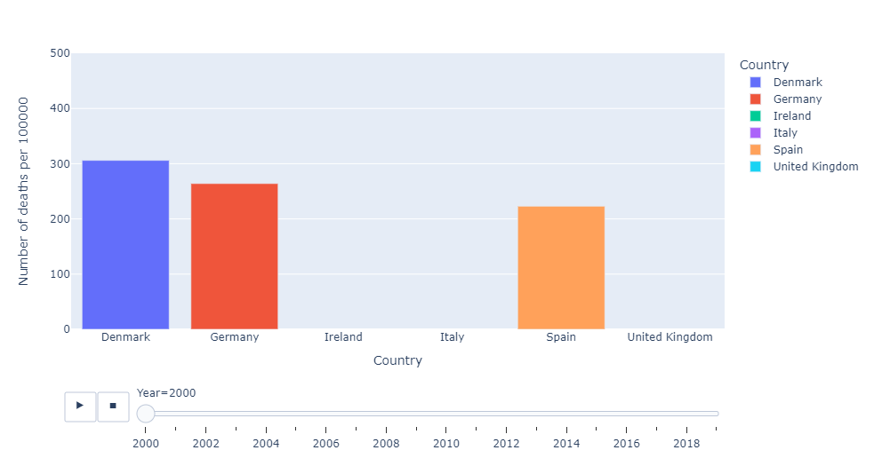
Plotly line graph 
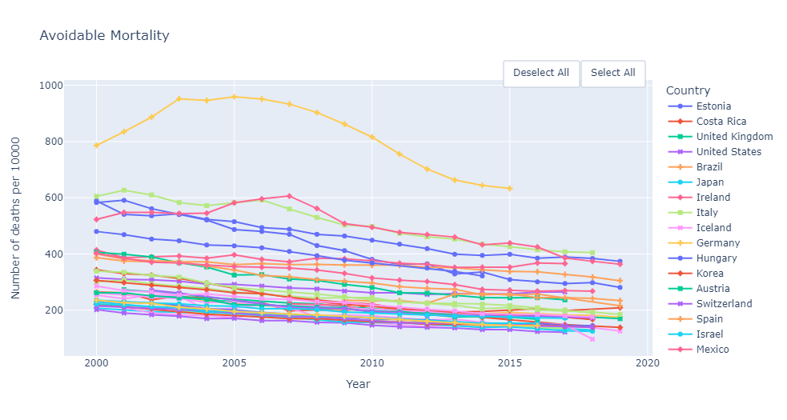
<h1>Heatmap</h1>
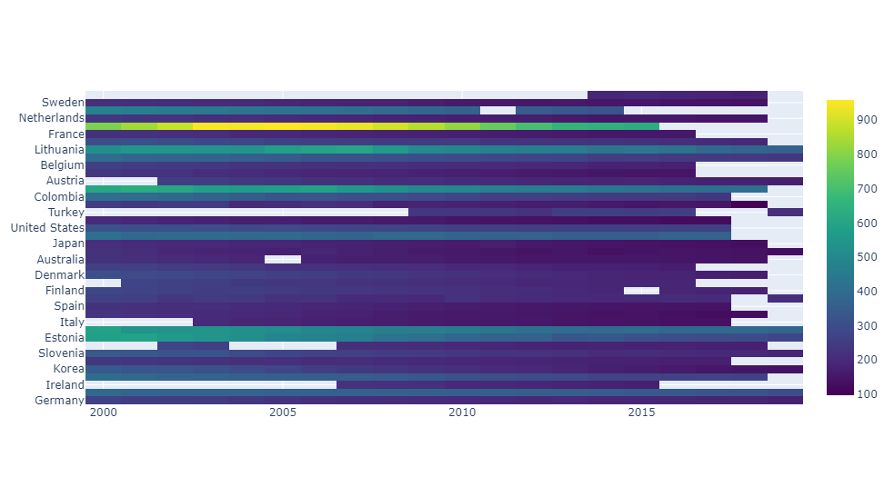
Plotly 3d graph
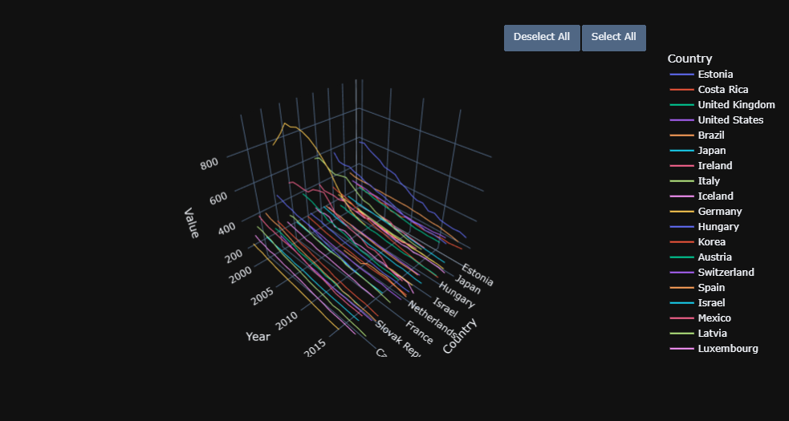
<h1>Area and scatter<h1>
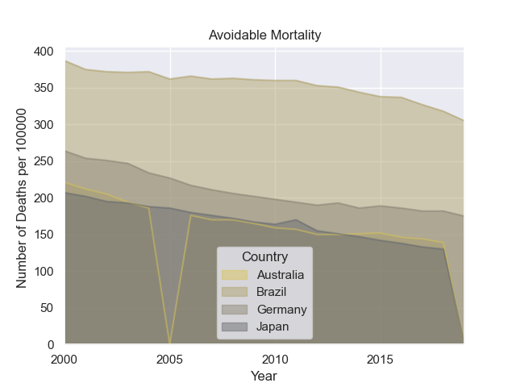
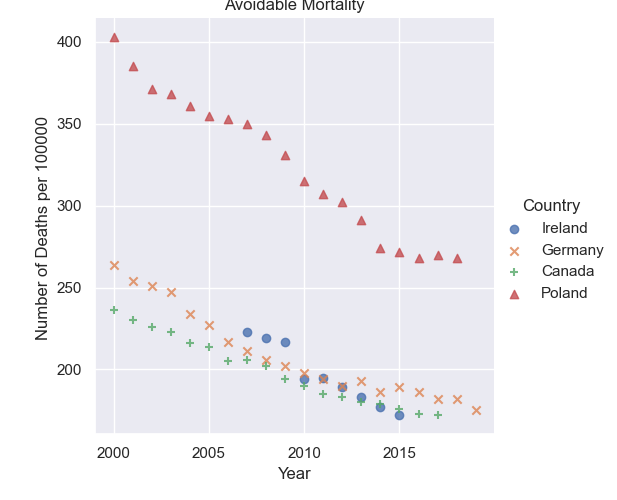